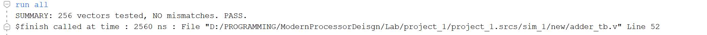
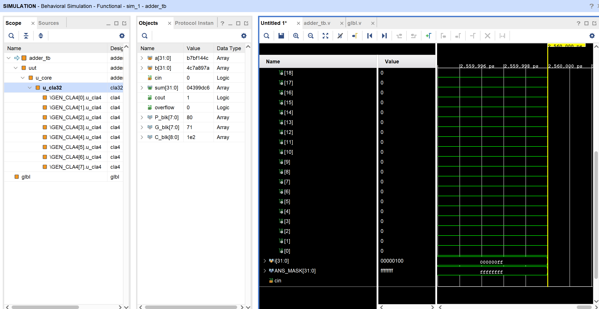
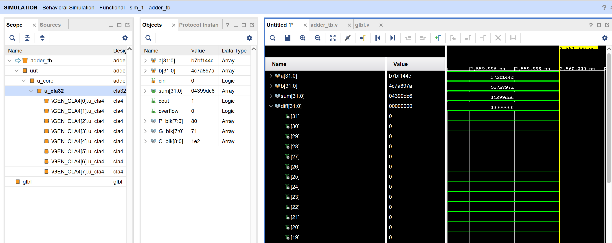

title: 32位超前进位加法器实验报告
author: 李佳祎 
number: 2023202295
date: 2025-10-07


---

# 1. 实验目的与个人初始状态

第一次拿到题目时，看到“32 位超前进位加法器”六个字其实是发怵的：我对 CLA 的“组产生 / 组传播”记不牢，课上只理论性地讲过，压根儿不知道具体如何在 Verilog 里优雅地写。再加上 Vivado 从没用过，如此原始的操作面板，用起来也挺费劲。

本实验的目标按指南很直接：

1. 设计一个 32 位、带超前进位逻辑的全加器；
2. 在 Vivado 工程模式下完成建工程、添加源文件、运行行为级仿真；
3. 利用随机激励与（后来我自己补的）自动检测手段核对正确性；
4. 体会超前进位减少“长进位链”延迟的结构思想。

我决定按“先小后大、先能跑再优化”的节奏推进：先把 4 位理解透，再扩到 32 位的分组结构。

# 2. 实验环境

| 项          | 说明                                      |
| ----------- | ----------------------------------------- |
| 操作系统    | Windows                                   |
| Vivado 版本 | 2024.2（实验指导写 2018.3，实际兼容）     |
| 主要文件    | `adder.v` / `adder_spec.v` / `adder_tb.v` |
| 语言        | Verilog HDL                               |

# 3. 设计思路演进

## 3.1 先复习全加器与 Ripple-Carry

把最朴素思路回忆一遍：位级 g_i = a_i & b_i，p_i = a_i ^ b_i，sum_i = p_i ^ c_i，串行进位 c_{i+1} = g_i | (p_i & c_i)。这条链 32 位会“很长”。

## 3.2 4-bit CLA 推公式

查资料 + 课件，重新写了一遍 4 位展开：

```

c2 = g1 | p1 g0 | p1 p0 c0
c3 = g2 | p2 g1 | p2 p1 g0 | p2 p1 p0 c0
c4 = g3 | p3 g2 | p3 p2 g1 | p3 p2 p1 g0 | p3 p2 p1 p0 c0
P_group = p3 p2 p1 p0
G_group = g3 | p3 g2 | p3 p2 g1 | p3 p2 p1 g0
```

这一段手写之后就“再次记住”了 CLA 的结构。这里我最初还差点忘了最后一项全传播 & c0。

## 3.3 扩展到 32 位

思路：8 个 4-bit 块 + 第二层块级超前。最初犹豫要不要写函数自动生成，但为了更容易 debug，第一版直接手工展开（虽然长，但清晰）。后面如果要推广再考虑脚本化。

## 3.4 接口差异的折中

实验统一接口只有 `a,b,sum`，但我调试时想看到 `cout` / `overflow`。做法：核心模块保留 cin/cout/overflow；再写包装 `adder_spec` 固定 cin=0 并只导出 sum。这样对助教给的 testbench、对报告都兼容。

# 4. 模块结构

| 模块         | 功能                   | 备注                            |
| ------------ | ---------------------- | ------------------------------- |
| `cla4`       | 4 位 CLA 位/组进位展开 | 产生 P_group / G_group          |
| `cla32`      | 8×`cla4` + 块级超前    | 手写展开块间进位 C_blk[1..8]    |
| `adder`      | 对外完整版             | 保留 cin/cout/overflow 便于扩展 |
| `adder_spec` | 实验提交用精简接口     | cin=0 包装器                    |

# 5. 关键公式与代码片段

### 5.1 4-bit 块（节选）

```verilog
assign c1 = g[0] | (p[0] & cin);
assign c2 = g[1] | (p[1] & g[0]) | (p[1] & p[0] & cin);
assign c3 = g[2] | (p[2] & g[1]) | (p[2] & p[1] & g[0]) | (p[2] & p[1] & p[0] & cin);
assign c4 = g[3] | (p[3] & g[2]) | (p[3] & p[2] & g[1])
				  | (p[3] & p[2] & p[1] & g[0])
				  | (p[3] & p[2] & p[1] & p[0] & cin);
```

### 5.2 组产生/组传播

```verilog
assign P_group = &p; // p[3]&p[2]&p[1]&p[0]
assign G_group = g[3] | (p[3]&g[2]) | (p[3]&p[2]&g[1]) | (p[3]&p[2]&p[1]&g[0]);
```

### 5.3 32 位块级进位（节选）

```verilog
assign C_blk[1] = G_blk[0] | (P_blk[0] & C_blk[0]);
assign C_blk[2] = G_blk[1] | (P_blk[1] & G_blk[0]) | (P_blk[1] & P_blk[0] & C_blk[0]);
// ... 直到 C_blk[8]
```

# 6. Testbench 迭代过程

| 阶段               | 内容                                       | 问题                            | 改进                     |
| ------------------ | ------------------------------------------ | ------------------------------- | ------------------------ |
| 初版               | 参考助教简单模板，循环随机赋值，肉眼看波形 | 很难“保证”全对，需要盯着 `diff` | 先接受，确认能跑         |
| 第二版             | 加 `diff = (a+b - sum)` 辅助信号           | 仍然人工判断                    | 想自动统计               |
| 第三版             | 加错误计数 `error_count`，循环中 #1 检查   | 输出格式单一                    | 加总结 PASS/FAIL         |
| 第四版（可选增强） | 自检 + 更多随机 + 定向用例 + overflow 检查 | 不符合“最简提交”接口            | 改为只作为开发版，不提交 |

最终提交保持：接口简单 + 自动统计汇总。结束时打印：
```
SUMMARY: 256 vectors tested, NO mismatches. PASS.
```
>下附结果截图：


>下附波形图：




# 7. 遇到的具体问题与解决

### 7.1 “不知道从哪下手”

最初盯着 32 位 CLA 感觉膨胀，拆成“先 4 位公式推导”后思路马上清晰。写完 4 位再复制 8 份 + 上层展开，一步一步堆起来。

### 7.2 Vivado 不熟 / 找不到波形

刚打开 2024.2 版界面时，找 Wave 窗口不顺：仿真后没自动显示。解决：在左侧 Scope 里右键信号 Add to Wave，或菜单 Window -> Simulation -> Waveform。

### 7.3 仿真看到 1000ns 就停

运行脚本里只有 `run 1000ns`，而自检循环需要 1005ns 才结束。表现是没看到 “ALL TESTS PASSED”。解决：改成 `run -all` 或补跑 `run 20ns`。
（这个 run -all 操作助教在上机课上提到过）

### 7.4 模块找不到 `adder_spec`

Testbench 实例化 wrapper，结果 elaboration 报 `Module <adder_spec> not found`。原因：只在文件系统创建，没 Add Sources。解决：Add Sources -> 指定该文件，重新仿真。

### 7.5 正确性验证太靠“肉眼”

问题：每次点开波形看 diff 是否 0 很机械。解决：在循环里加 `if (diff !== 0)` 统计并汇总，结果一眼判断 PASS/FAIL，同时保留 diff 便于定位。


### 7.6 接口不符合实验要求

核心加法器最初带 cin/cout/overflow，担心提交不合格。解决：写 `adder_spec` 包装，cin 固定 0，隐藏额外端口。

### 7.7 是否需要 4 位版本

文档提示可以先做 4 位。考虑到时间，我在说明里交代“先做 4 位推导”，未单独保留 4 位模块文件；若需要可以很快补一个 `adder4` 高位补零版本。

# 8. 波形与结果说明

说明：

* diff 信号在全程保持 0，表示 `sum` 与 (a+b) 低 32 位一致；
* 随机向量跨度明显（波形十六进制值变化大），覆盖一定广度；
* 无 mismatch 打印。


# 9. 结果与分析

* 功能：随机 256 组全部通过，说明基本逻辑正确。
* 结构：双层 CLA 消除了线性 32 级串行进位，理论关键路径 ≈ 4 位内部展开 + 一次块级组合。
* 代码可维护性：手写块级表达式虽然长，但清晰直观。后续可用脚本生成或改为 Kogge‑Stone 前缀。
* 包装接口让核心更灵活：以后要加 pipeline 或拓展成加减（加上补码/选择逻辑）不影响实验接口。

# 10. 版本与兼容性说明

实验指导建议的 2018.3 与本次使用的 2024.2 在本场景（纯 RTL 组合逻辑 + 行为仿真）下无功能差异。出现的 Board 相关警告与本实验无关。

# 11. 可能的改进方向

| 方向             | 价值         | 简述                                      |
| ---------------- | ------------ | ----------------------------------------- |
| 自动脚本生成 CLA | 减少手写错误 | 用 Python 拼接进位展开                    |
| 前缀树加法器     | 更平衡扇入   | Kogge-Stone / Brent-Kung                  |
| 覆盖率统计       | 验证“充分性” | SystemVerilog covergroup（需要 SV 支持）  |
| 溢出标志验证     | 更严谨       | 在增强 testbench 中添加 overflow 期望比对 |
| 参数化位宽       | 复用         | `parameter WIDTH=32` + 生成式逻辑         |

# 12. 总结

从“有点发懵”到“公式写清楚”再到“仿真能跑、结果自动判 PASS”，核心体会是：

1. 先缩小问题（4 位推导）再扩展；
2. 结构分层（cl a4 → cla32 → wrapper）让代码自然；
3. 工具不熟就搜索官方 / 教程（加快定位 Wave 与 run -all）；
4. 自动化校验能显著减少人工盯波形的心智负担，避免“看漏错”。

最终版本满足实验接口要求，并附加了工程化可扩展的核心。若后续课程需要 ALU 组件，此模块可直接复用或扩展。

