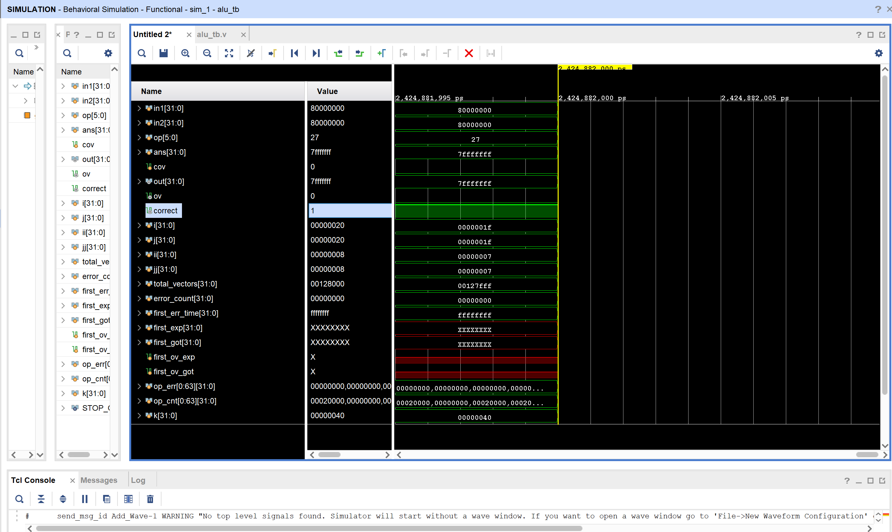
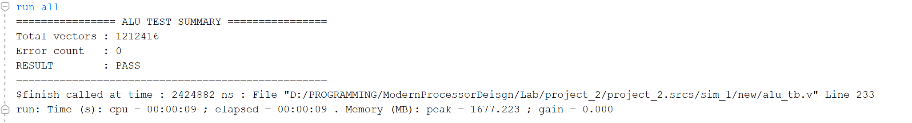

# 实验 2：32 位 ALU 设计与仿真报告

> 李佳祎 2023202295

## 1. 实验目的

1. 练习用 Verilog 描述一个 32 位组合逻辑 ALU，支持指导文档列出的 11 种运算（ADD / ADDU / SUB / SUBU / SLL / SRL / SRA / AND / OR / XOR / NOR）。
2. 复用上一次实验的超前进位加法器结构，体会模块化与多文件组织。
3. 在 Vivado 中编写/添加 testbench，运行行为级仿真并验证功能正确性。

## 2. 实验环境

| 条目     | 说明                                              |
| -------- | ------------------------------------------------- |
| 操作系统 | Windows (本机)                                    |
| EDA 工具 | Vivado (课堂环境版本，含内置仿真器)               |
| 语言     | Verilog HDL                                       |
| 时间基准 | `timescale 1ns / 1ns`（按照实验指导建议手动改） |

## 3. 设计要求与总体思路

### 3.1 功能点

| 类别       | 指令                 | 说明               | Over 规则          |
| ---------- | -------------------- | ------------------ | ------------------ |
| 有符号算术 | ADD / SUB            | 需要判断有符号溢出 | 根据符号位组合判定 |
| 无符号算术 | ADDU / SUBU          | 仍用同一套加法器   | Over 恒 0          |
| 移位       | SLL / SRL / SRA      | 位移量取 A[4:0]    | 恒 0               |
| 位逻辑     | AND / OR / XOR / NOR | 逐位运算           | 恒 0               |

### 3.2 模块划分

```
alu.v
 ├─ cla4（4 位基本块）
 ├─ cla32（8×cla4 + 块级进位展开）
 ├─ adder（对 cla32 的简单封装）
 └─ alu（顶层：实例化两份 adder 做加/减，case 选择输出）
```

### 3.3 关键点

* 纯组合逻辑，`always @*`，不引入时钟，避免综合出寄存器或锁存器。
* SUB 通过 `A + (~B + 1)` 实现。为减少“写错补码”风险直接实例化第二个 adder。
* 溢出仅对有符号 ADD/SUB 判定：
  - `ADD`：操作数符号相同且结果符号不同。
  - `SUB`：操作数符号不同且结果符号与 A 不同。
* 算术右移使用 `$signed(B) >>> shamt`，其它移位采用逻辑运算符。
* 移位量统一用 `A[4:0]`，与 testbench 保持一致，避免出现 >31 的不确定行为。

## 4. 接口定义

模块原型：`module alu(A,B,Op,C,Over);`

| 信号 | 方向   | 位宽 | 说明                                  |
| ---- | ------ | ---- | ------------------------------------- |
| A    | Input  | 32   | 第一个操作数；同时提供移位位数 A[4:0] |
| B    | Input  | 32   | 第二个操作数                          |
| Op   | Input  | 6    | 指令编码（与实验指导一致）            |
| C    | Output | 32   | 运算结果                              |
| Over | Output | 1    | 溢出（仅 ADD/SUB 有符号生效）         |

## 5. 关键逻辑代码（节选）

加 / 减双路径：

```verilog
adder u_add (.a(A), .b(B),  .cin(1'b0), .sum(add_sum), .overflow(add_of));
adder u_sub (.a(A), .b(~B), .cin(1'b1), .sum(sub_sum), .overflow()); // 自己判溢出
```

溢出判定：

```verilog
wire add_overflow_signed = (A[31] == B[31]) && (add_sum[31] != A[31]);
wire sub_overflow_signed = (A[31] != B[31]) && (sub_sum[31] != A[31]);
```

算术右移：

```verilog
C = $signed(B) >>> A[4:0];
```

（全文代码在 `alu.v`，这里不重复黏贴。）

## 6. Testbench 思路

* 原始提供的 `alu_tb.v` 枚举多组稀疏位形态：`ii<<i` 与 `jj<<j` 组合，能覆盖不同位位置的进位/借位传播场景。
* 针对加减：for 四层循环，内部计算期望值 `ans` 和溢出标志 `cov`。
* 本次在 testbench 上做了改进：加入自动统计任务 `record_result`，结束时打印：
  - 总用例数 / 错误数
  - 首个出错时刻、输入、期望/实际结果
  - 按 opcode 的错误分布（若有）。

```verilog
 // 输出总结
        $display("================ ALU TEST SUMMARY ================");
        $display("Total vectors : %0d", total_vectors);
        $display("Error count   : %0d", error_count);
        if(error_count==0) begin
            $display("RESULT        : PASS");
        end else begin
            $display("RESULT        : FAIL");
            $display("First error at %0t ns", first_err_time);
            $display("  op=%b in1=%h in2=%h", op, in1, in2);
            $display("  expected C=%h Over=%b", first_exp, first_ov_exp);
            $display("  got      C=%h Over=%b", first_got, first_ov_got);
            // 简单列出出现过错误的 op
            for(k=0;k<64;k=k+1) if(op_err[k]>0) begin
                $display("  OP %06b : %0d errors / %0d vectors", k[5:0], op_err[k], op_cnt[k]);
            end
        end
        $display("==================================================");
```

## 7. 仿真步骤

1. 将 `alu.v` 作为 **Design Sources** 添加；`alu_tb.v` 作为 **Simulation Sources** 添加并设为仿真顶层。
2. 确认所有文件首行 `timescale` 已改为 `1ns / 1ns`。
3. Run Behavioral Simulation，等待跑完整个 2.4µs 左右的波形。
4. Console 中查看汇总：若显示 PASS 且错误为 0 即可。
5. 额外用波形工具搜索：`correct` 是否曾为 0（Find Value）。

## 8. 仿真结果

文字观察：

- 控制台打印：`RESULT : PASS`，`Error count : 0`。
- 在波形里查看 ADD 边界：`0x7fffffff + 1` 时 Over = 1；`0x80000000 - 1` 也能正确置位。
- SRA 对 `B=0xF0000000` 右移若干位时高位保持 1，符合预期。
- 


## 9. 遇到的小问题与解决

| 问题                     | 现象                               | 排查 & 解决                                                                |
| ------------------------ | ---------------------------------- | -------------------------------------------------------------------------- |
| overflow 公式一开始写混  | SUB 情况某些用例溢出错             | 回头对照 testbench 写法，重新用“符号不同且结果符号与 A 不同”表达式，修正 |
| 忘记限制移位位数         | SRL/SRA 某些大于 31 位移出现不稳定 | 明确统一使用 `A[4:0]`，与题目 / testbench 逻辑一致                       |
| testbench 人工看结果费时 | 需要鼠标找 correct                 | 加入统计任务和汇总打印，省掉人工翻波形                                     |
