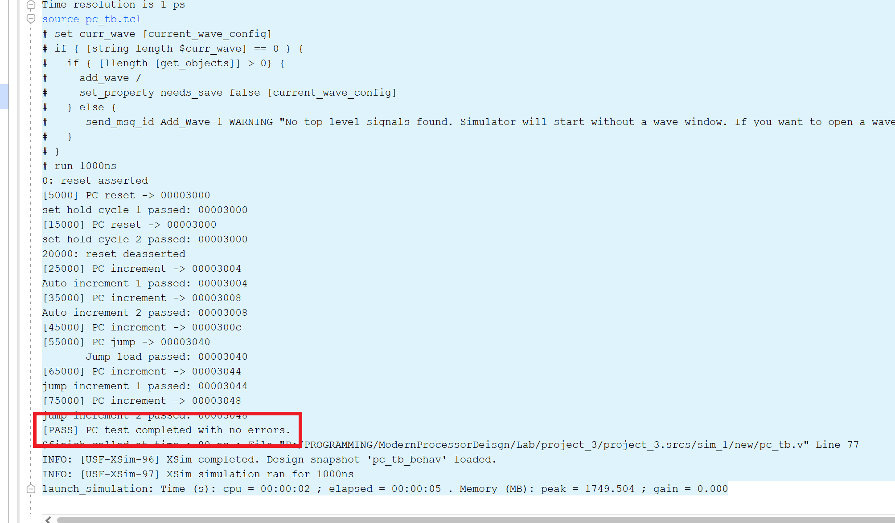

# 实验报告｜PC 寄存器与数据存储器模块

> 李佳祎 2023202295

## 一、实验环境

- 开发工具：Vivado 2024.2（xsim 行为级仿真）
- 仿真设定：`CLK_HALF = 5ns`，即 100 MHz 时钟；所有测试均以行为仿真完成
- 工程位置：`Lab/project_3`

## 二、实验要求

1. 编写一个具备同步复位、顺序自增与跳转功能的 Program Counter 模块。
2. 实现一个 4 KiB、按字对齐访问的数据存储器模块，支持同步写入、组合读取与同步复位清零。
3. 自行设计 testbench，验证 PC 的自增/跳转，以及数据存储器的读写正确性。

## 三、设计实现概述

### 1. Program Counter（`program_counter.v`）

- 采用同步复位，复位向量固定为 `0x0000_3000`。
- 正常运行时每个时钟上升沿自增 4；当 `jumpEnabled` 拉高时，优先加载 `jumpInput`。
- 为了调试方便，在 `always @(posedge clock)` 中保留了简单的 `$display`，仿真时可以直观看到复位、自增和跳转发生的时间点。

### 2. Data Memory（`data_memory.v`）

- 使用 `reg [31:0] mem [0:1023];` 建立 32 位 × 1024 深度的寄存器堆，总容量 4 KiB。
- 复位时遍历数组清零；写入在上升沿对 `address[11:2]` 对应的单元赋值，读出为组合逻辑。
- 同样保留了 `$display`，记录复位与写入事件，便于比对 testbench 的操作。

## 四、仿真与验证

### 1. PC Testbench（`pc_tb.v`）

- 时钟周期 10 ns，复位保持两个周期。设计了 `expect_at_negedge` 和 `expect_after_cycles` 两个任务，在每个负沿采样 `pcValue`。
- 验证步骤：
  1. 复位保持阶段确认 PC 恒为 `0x3000`；
  2. 释放复位后连续两次自增，期望值分别为 `0x3004`、`0x3008`；
  3. 在负沿准备 `jumpInput = 0x3040` 并拉高 `jumpEnabled`，下一个上升沿加载跳转地址；
  4. 跳转后继续观察两次自增，期望值 `0x3044`、`0x3048`。
- Testbench 会在所有检查通过时打印 `[PASS] PC test completed with no errors.`，否则直接 `$fatal`，便于一眼判断结果。

### 2. Data Memory Testbench（`data_memory_tb.v`）

- 依旧使用 10 ns 时钟，`write_word` 任务在下降沿准备地址和数据、在随后的上升沿写入，确保写使能脉冲宽度充足。
- 验证流程：
  1. 复位清零后立刻读取地址 0，应返回 0；
  2. 依次向地址 `0x0`、`0x4` 写入 `DEAD_BEEF`、`CAFE_1234`，检查读回；
  3. 访问从未写入过的地址 `0x8`，确认仍为 0；
  4. 拉低 `writeEnabled` 的情况下改变 `writeInput`，验证不会误写；
  5. 全流程结束时如果 `errors == 0`，打印 `[PASS] Data memory test completed with no errors.`。
- 额外打印了 `dut.mem[...]` 的内容，作为波形截屏以外的文字证据。
  
  

## 五、遇到的坑与解决策略

1. **数据存储器写入失败**：最初的 `write_word` 任务在同一个上升沿立即拉低 `writeEnabled`，导致实际写入脉冲宽度为 0，存储器保持全 0。改为在下降沿准备信号、上升沿写入并在下一个下降沿释放写使能后问题解决。
2. **读数出现 X**：复位后的第一次读操作太早进行，会捕获到尚未完成清零的 `X` 值。通过额外等待一个时钟周期，再在下降沿采样，把 `X` 变成可确定的 0。
3. **PC 自检期望值偏差**：最初在释放复位后的那一刻仍然期望 PC 为 0x3000，忽略了同步逻辑会在同一个上升沿立即自增。重新梳理时间线后，按“复位保持 → 自增 → 跳转 → 再自增”的顺序设置检查点，测试顺利通过。

## 六、个人体会

- 同步逻辑的“发生在上升沿之后”这一细节在写 testbench 时很容易忽略，采样时刻选错，就会产生莫名其妙的错误，误导我条很久的错。
- 把 `$display` 当作“仿真版 printf”很管用，尤其是在排查写入失败时，日志能直接告诉我到底写没写进去。
- 自动判定（`errors` 计数+`$fatal`）省去了人眼翻波形的痛苦，也让报告里能拿出“PASS/FAIL”明确结论。
