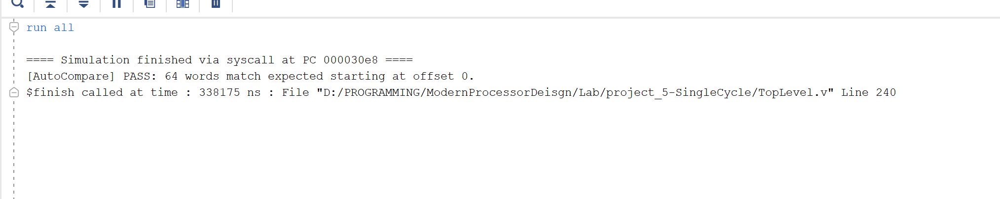
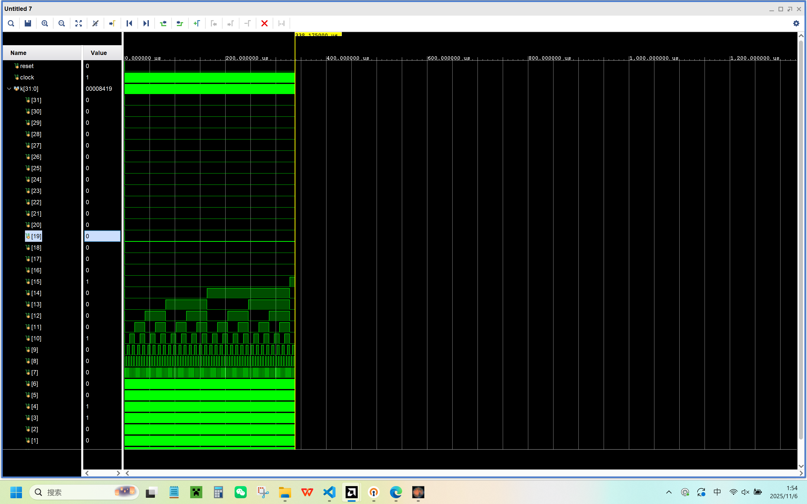
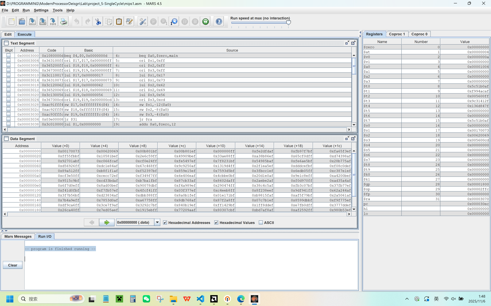

# 单周期 MIPS CPU 实验报告（Project 5 - SingleCycle）

> 李佳祎 2023202295

## 1. 模块与接口

- ProgramCounter：保持/更新 PC，复位为 0x00003000。
- InstructionMemory：4KiB 指令存储，仿真用 `$readmemh` 从绝对路径加载 `code.txt`。
- RegisterFile：32×32 通用寄存器，$0 恒 0，上升沿写入，复位清零。
- ArithmeticLogicUnit：支持 ADD、SUB、OR、AND、PASS，输出 zero 给 BEQ 用。
- DataMemory：4KiB 数据存储，组合读、时钟沿写。只允许字对齐访问。
- Controller：硬布线译码，给出寄存器目标、写回数据来源、ALU 控制、分支/跳转等信号。
- TopLevel：把通路和控制拼起来，处理分支/跳转优先级，遇到 `syscall` 结束仿真。

我把常量放在 `cpu_defs.vh`，顶层用 `TopLevel`，测试用 `mips_tb.v`。

## 2. 控制信号（怎么解码）

- reg_dst_sel：写回目的寄存器选择（rt/rd/$ra）。
- reg_write_data_sel：写回数据来源（ALU/MEM/PC+4/LUI）。
- reg_write、alu_src、mem_read、mem_write、branch、jump、jump_reg、use_zero_extend、is_syscall。
- alu_control：自定义 4bit 操作码（ADD、SUB、OR、AND、PASS）。

指令对应关系（只列我这次用到的）：

- R 型：addu/subu（写 rd）、jr（寄存器跳转）、syscall（仿真终止）。
- ori：零扩展，写 rt。
- lw/sw：地址用 ADD 计算，lw 写回内存读数。
- beq：用 SUB 判断 zero，目标 `PC+4+SignExt(imm)<<2`。
- lui：写 rt，`{imm,16'b0}`。
- jal：写 $ra=PC+4，跳转到立即数目标。

PC 选择顺序我采用：先 BEQ，再 J/JAL，最后 JR（JR 最高优先级）。

## 3. 一个小坑（也是我重点修的地方）

我的汇编 `mips1.asm` 在主循环里每次调用 `func` 后都会 `a0+=4`，初始 `a0=4`，循环 1024 次，末尾 `a0≈0x1004`。而 DataMemory 只有 4KiB（索引 0..1023），如果不做边界检查，把地址用 `address[11:2]` 直接索引，`0x1000` 会“回卷”成索引 0——结果把一开始 `initial` 写在 0..4 的头部数据给覆盖了。

我加了对齐与范围检查：

```verilog
// DataMemory.v 中
if ((address[1:0]==2'b00) && (address[31:12]==20'b0)) begin
    // 合法读写
end else begin
    // 非法：读返回0，写忽略（仿真策略）
end
```

修完以后，头 5 个字不再被末尾“回卷写”覆盖。

## 4. 自动比较器（为了少对照几次）

我在顶层 `TopLevel.v` 里做了一个很轻量的自动比较：

- 在 syscall 时读取 `dm_expected.txt`（从 MARS 导出的十六进制文本，每行 1 个 32 位数），默认比较前 64 个 word。
- 采用“滑动窗口”匹配，能找到最佳对齐 offset，避免导出窗口不同导致的“假失败”。
- 打印一句 PASS/FAIL 的 summary；需要详细差异时再开 `SIM_DEBUG` 看细节。

用法：把 `dm_expected.txt` 放在工程路径，仿真跑到 syscall 会自动打印：

```
[AutoCompare] PASS: 64 words match expected starting at offset 0.
```

类似这样就说明对上了。

## 5. 我是怎么验证的（配图）

下面是我本地跑出来的关键截图，看图就能对上：

Vivado 仿真+自动比较器 PASS 的输出：


如果需要，也可以在波形里加 PC、指令、寄存器写回、ALU 结果、数据存储器地址/写数据这些信号，我这次主要靠控制台输出就定位了越界写的问题。

## 6. 路径与运行的小提示

- `InstructionMemory` 的 `INIT_FILE` 我用了绝对路径，Windows 下需要双反斜杠，例如：
  `D:\\PROGRAMMING\\ModernProcessorDeisgn\\Lab\\project_5-SingleCycle\\code.txt`
- 用 MARS 生成 `code.txt`（HexText）和 `dm_expected.txt`（纯 32 位十六进制数逐行），建议都放在工程目录，省得路径错。
- 需要更安静的输出时，不要开 `SIM_DEBUG`；要看细节（比如某次 SW 的来源），临时加上 `SIM_DEBUG` 再跑一遍。

最后贴上mars截图
