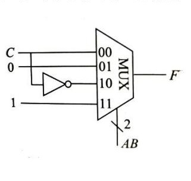

## 1, 用公式法化简

 $\mathsf{A}\overline{B} + \mathsf{C} + \overline{A}\overline{C}D + \mathsf{B}\overline{C}\mathsf{D}$

## 2, 用卡诺图化简

$$
\begin{cases} F = C + \overline{A}\overline{B}CD + A\overline{B}\overline{D} + \overline{B}\overline{C}\overline{D} \\ AD + BC = 0 \end{cases}
$$

3, 假设 A, B, C 为输入变量, 写出下面图中电路输出对应函数的最简与或式。

4, 用 ROM 实现函数运算 Z=X``2``Y , 写出输出的最小项表达式。
