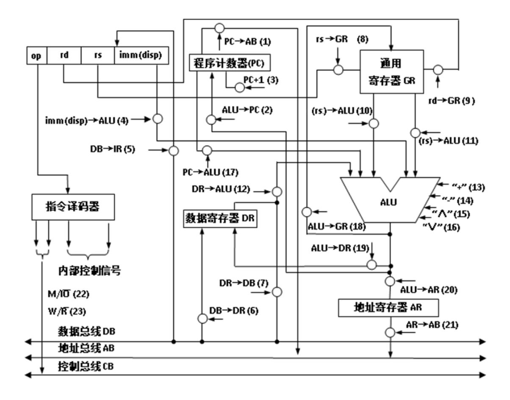

16 位计算机数据总线和地址总线都是 16 位,CPU 结构如下图所示,指令系 统包括 4 条指令,addi,lw,sw,add,指令的格式固定,单字长(16 位),指令格 式如下所示,其中 op 为操作码,rd 为目的寄存器,rs 为源寄存器,imm 为立即 数。共 8 个通用寄存器,寄存器 R0 的值恒为 0。

## op| rd | rs | imm

- addi: (rd) <- (rs) + imm
- lw: (rd) <- ((rs) + imm)
- sw: ((rs) + imm) <- (rd)
- add: (rd) <- (rd) +(rs)

1. 写出指令中各字段的位数,自己定义每个字段值的具体含义。

2. 存储器按字进行编址,字长为16位。假设主存地址1开始有一个 short 型数组,共3个元素,请写出该计算机所支持的一段机器指令程序,求整个数组的和,并写到地址0处,用16进制形式表示。(假设寄存器均可用)

3. 请写出 addi, lw, sw, add 这 4 条指令执行各需要几个机器周期,每个机器 周期需要哪些微命令?

4. 采用硬布线的控制器实现方式,请给出控制器的设计,即写出 23 个控制 信号的表达式 (M/*IO*=1 表示访问内存,=0 表示访问 IO; W/*R*=1 表示写操作,=0 表示读操作)。