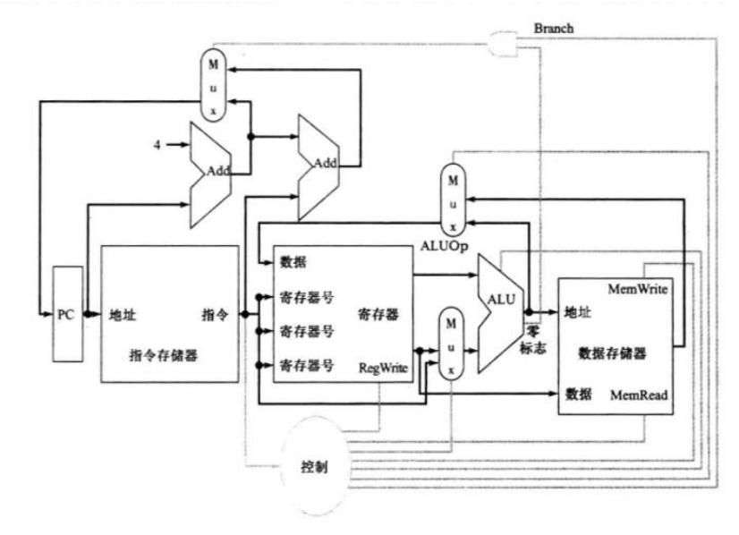
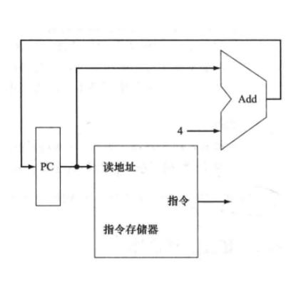
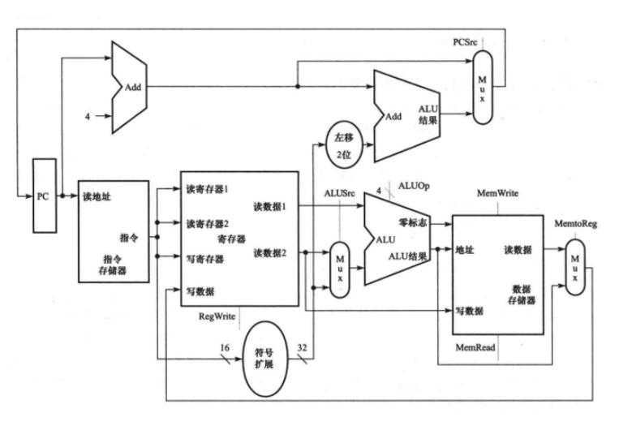

4.2 图 4-2 中基本的单周期 MIPS 实现仅能实现某些指令。可以在这个指令集中加入新的指令,但决定是否加入取决于给处理器的数据通路和控制通路增加的成本和复杂度。对下面的新指令而言,试回答下列 3 个问题: 

指令:LWI Rt,Rd(Rs)

解释: Reg[Rt] = Mem[Reg[Rd] + Reg[Rs]]

- **4.2.1** [10] <4.1 > 对上述指令而言,哪些已有的单元还可以被使用?
- **4.2.2** [10] <4.1 > 对上述指令而言,还需要增加哪些功能单元?
- **4.2.3** [10] <4.1 > 为了支持这些指令,需要在控制单元增加哪些信号?

4.4 本练习题中的题目假定在实现一个处理器的数据通路时,逻辑模块的延时如下:

| I-Mem | Add  | Mux  | ALU  | Regs | D-Mem | Sign-Extend | Shift-Left-2 |
|-------|------|------|------|------|-------|-------------|--------------|
| 200ps | 70ps | 20ps | 90ps | 90ps | 250ps | 15ps        | 10ps         |

- **4.4.1** [10] <4.3 > 如果处理器只需做连续取指这一件事(见图 4-6),那么时钟周期是多少?
- 4.4.2 [10] <4.3>考虑一个与图 4-11 类似的数据通路,但是假设处理器只需处理无条件相对跳转指令,那么时钟周期是多少?
- 4.4.3 [10] <4.3>重做练习题 4.4.2,但这次假设只需处理有条件相对跳转指令。 本练习题中剩下的三个问题是关于 Shift-Left-2 数据通路单元的:
- **4.4.4** [10] < 4.3 > 哪些类型的指令需要该单元?
- 4.4.5 [20] <4.3 > 对哪些类型的指令而言,该单元位于关键路径上?
- 4.4.6 [10] <4.3 > 假设仅需支持 beq 指令和 add 指令,讨论该单元的延迟变化对处理器时钟周期的影响。假定其他单元的延迟不变。

